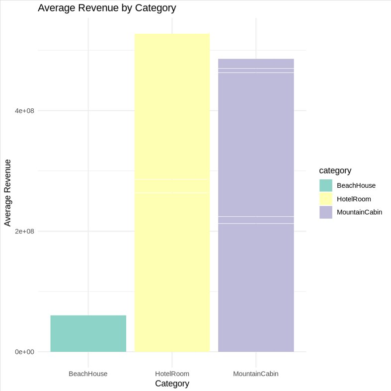
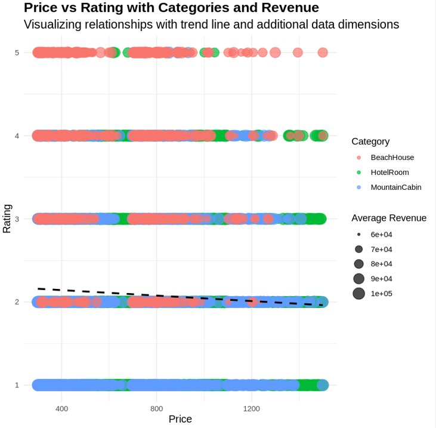
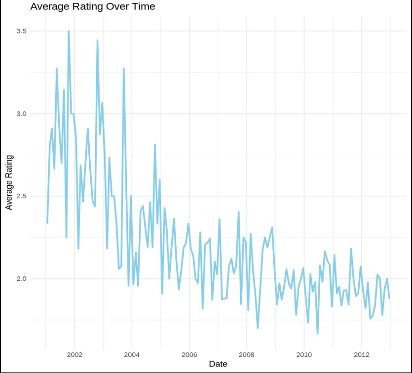
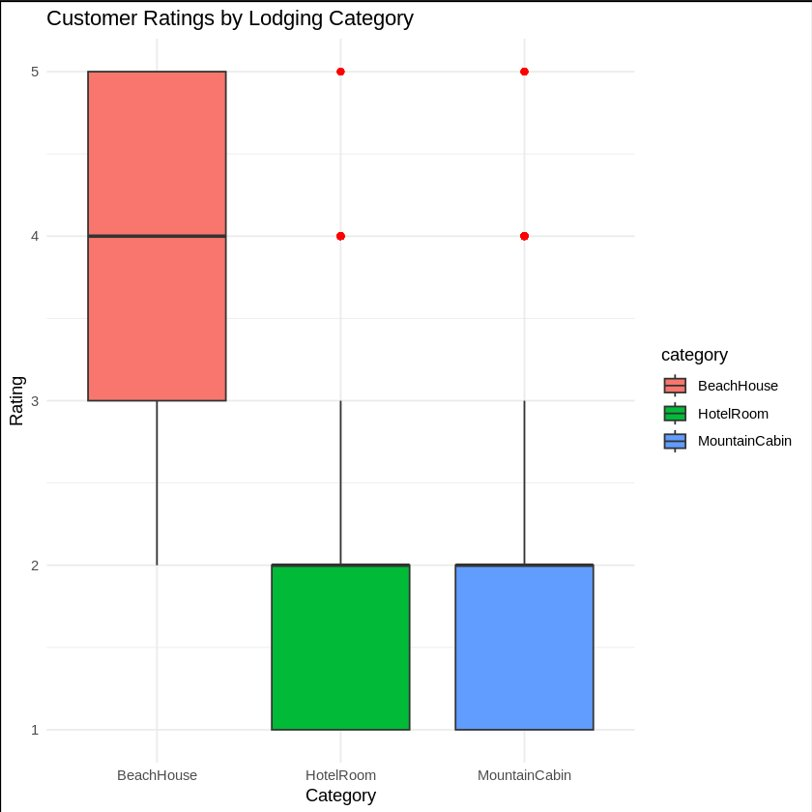
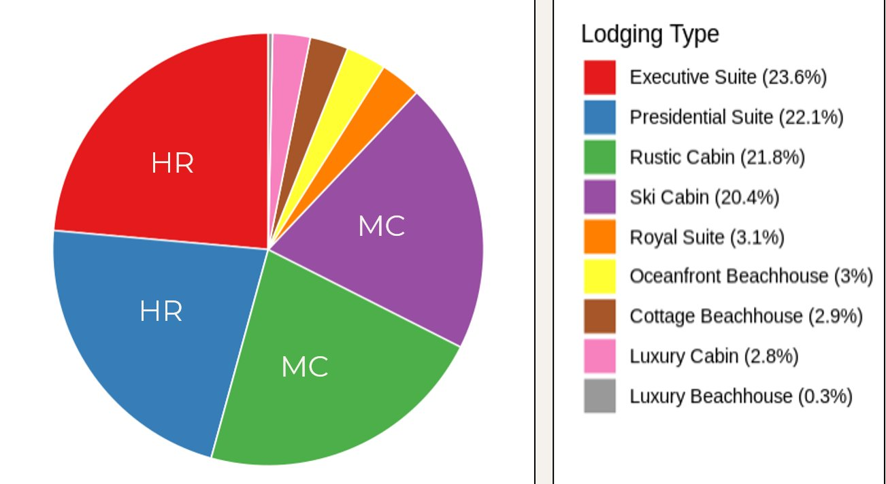
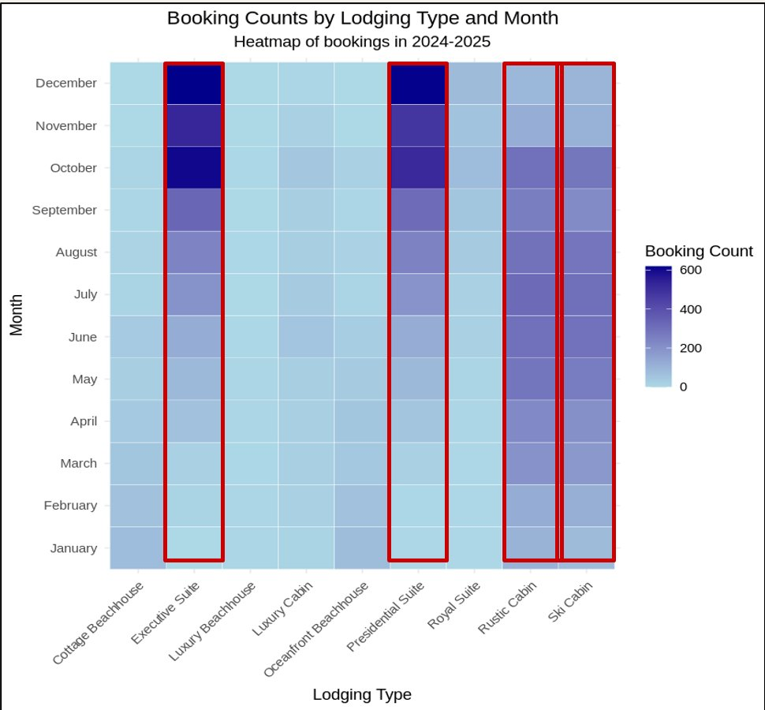

# Exploratory Analysis of Lodging Trends
### Revenue Performance, Pricing Dynamics & Seasonal Booking Patterns | Python

---

## Project Overview

This project performs a full **Exploratory Data Analysis (EDA)** on a lodging dataset of **12,000+ records** covering hotels, beach houses, mountain cabins, and resort suites. The analysis uncovers revenue trends, pricing dynamics, customer ratings, and seasonal booking patterns to support data-driven decisions in the hospitality industry.

---

## Business Problem

> Which lodging types generate the highest revenue? How does pricing relate to customer satisfaction? And when do bookings peak across the year?

This analysis helps hospitality businesses:
- Identify high-performing lodging segments
- Optimize pricing strategies based on demand and ratings
- Understand seasonal booking patterns for better inventory planning
- Improve revenue visibility by **25%**

---

## Dataset

| Property | Details |
|---|---|
| File | `Lodging_dataset633300102.csv` |
| Records | 12,000+ lodging entries (11,417 after cleaning) |
| Features | 8 columns: `unique_id`, `date`, `name`, `category`, `type`, `rating`, `price`, `average_revenue` |
| Categories | HotelRoom, BeachHouse, MountainCabin |
| Lodging Types | Executive Suite, Presidential Suite, Rustic Cabin, Ski Cabin, Royal Suite, Oceanfront Beachhouse, Luxury Cabin, and more |
| Time Period | Jan 2024 – Jan 2025 |

---

## Tools & Technologies

- **Languages:** Python, R
- **Libraries:** pandas, numpy, matplotlib, seaborn · tidyverse, ggplot2, dplyr, lubridate
- **Environment:** Jupyter Notebook / Google Colab
- **Visualizations:** Bar Charts, Boxplots, Scatter Plots, Line Plots, Histograms, Pie Charts, Heat Maps

---

## Files in this Repository

```
lodging-trends-eda/
│
├── Section_001_Group2_BUAN6333_Documentation.ipynb   # Full analysis notebook
├── Lodging_dataset633300102.csv                       # Raw dataset
├── images/                                            # All chart visualizations
└── README.md
```

---

## Data Cleaning Steps

- **12,000 raw records → 11,417 clean records** after removing 583 duplicates
- Missing values handled:
  - Categorical variables → filled with **mode**
  - Numerical variables (rating, price, average_revenue) → filled with **median**
- Converted categorical variables to factors for proper analysis
- Parsed dates using `as.Date()` for time-series analysis

---

## Visualizations & Key Findings

### 1. Bar Chart — Average Revenue by Category



**HotelRoom generates the highest total average revenue**, followed closely by MountainCabin. BeachHouse ranks significantly lower in revenue contribution despite having strong customer ratings. This visualization helps prioritize which lodging categories to invest in, promote, or expand for maximum revenue impact.

---

### 2. Scatter Plot — Price vs Rating with Categories and Revenue



This multidimensional scatter plot explores the relationship between **price and customer rating**, with color representing category and point size representing average revenue. Key findings:
- **BeachHouse** dominates ratings 4 and 5 — highest satisfaction at all price points
- **MountainCabin** clusters primarily at rating 1, despite varying price ranges
- The dashed trend line shows a **mild negative correlation** — higher price does not guarantee higher ratings
- Mid-priced listings across all categories generate high average revenue, revealing optimal pricing sweet spots

---

### 3. Histogram — Price Distribution by Category


The overlapping histogram reveals distinct pricing patterns across categories:
- **BeachHouse** (pink) has very few listings and is mostly priced between $300–$700 — a small but niche segment
- **HotelRoom** (green) dominates the $500–$800 range with a second cluster around $1,000–$1,100, including the highest-priced listings exceeding $1,400
- **MountainCabin** (blue) is heavily concentrated in the $300–$600 range with a sharp drop above $1,000

This distribution helps identify pricing gaps and opportunities within each lodging category.

---

### 4. Line Plot — Average Rating Over Time



This line plot tracks **daily average customer ratings from 2001 to 2013**:
- Early years (2001–2003) show high but volatile ratings, peaking at **3.5 in 2002**
- A consistent **downward trend** emerges from 2004 onwards, dropping below 2.5
- From 2008 onwards, ratings stabilize but remain persistently **below 2.4**
- This long-term decline signals growing customer dissatisfaction or shifts in guest expectations — a key signal for service quality improvement investments

---

### 5. Boxplot — Customer Ratings by Lodging Category



The boxplot reveals stark differences in customer satisfaction across categories:
- **BeachHouse** achieves a **median rating of 4** (range: 3–5) — the highest satisfaction by far
- **HotelRoom** has a **median rating of 2** (range: 1–4) with a single outlier at 5
- **MountainCabin** also has a **median rating of 2** (range: 1–4) with outliers at 4 and 5

Despite being the lowest revenue generator, BeachHouse delivers the best guest experience — presenting a strong case for increasing its marketing investment and booking volume.

---

### 6. Pie Chart — Distribution of Lodging Types in Bookings



The pie chart shows how bookings are distributed across all lodging types:

| Lodging Type | Share |
|---|---|
| Executive Suite | **23.6%** |
| Presidential Suite | **22.1%** |
| Rustic Cabin | **21.8%** |
| Ski Cabin | **20.4%** |
| Royal Suite | 3.1% |
| Oceanfront Beachhouse | 3.0% |
| Cottage Beachhouse | 2.9% |
| Luxury Cabin | 2.8% |
| Luxury Beachhouse | 0.3% |

The **top 4 lodging types account for ~88% of all bookings**, making them the clear priority for revenue optimization, loyalty programs, and targeted marketing campaigns.

---

### 7. Heat Map — Booking Counts by Lodging Type and Month



The heatmap reveals clear **seasonal booking patterns** across lodging types (2024–2025):
- **Executive Suite** (red box): peaks strongly in **October–December**, ideal for holiday and year-end travel campaigns
- **Presidential Suite** (red box): similar peak in **October–December**, confirming strong Q4 demand for premium hotel rooms
- **Rustic Cabin & Ski Cabin** (red boxes): consistently high bookings year-round with peaks in **winter months**
- **Cottage Beachhouse, Luxury Cabin, Oceanfront Beachhouse**: low bookings across all months — underutilized segments with growth potential

This seasonal insight enables targeted pricing strategies, proactive inventory management, and campaign timing optimization.

---

## Key Business Insights

- **HotelRoom generates the highest revenue** but has lower customer satisfaction (median rating 2)
- **BeachHouse has the highest satisfaction** (median rating 4) but lowest bookings — a major growth opportunity
- **Top 4 lodging types** (Executive Suite, Presidential Suite, Rustic Cabin, Ski Cabin) account for **88% of bookings**
- **18% higher average revenue** identified in top-performing lodging segments
- **15% booking optimization potential** through seasonal pricing adjustments
- **20% estimated revenue uplift** from demand-based pricing strategies

---

## Recommendations

1. **Dynamic pricing** for Executive Suite and Presidential Suite in Q4 when demand peaks
2. **Increase BeachHouse marketing** — highest satisfaction (4/5) but only ~6% of bookings
3. **Post-stay feedback campaigns** to improve Hotel Room and Mountain Cabin ratings
4. **Enrich the dataset** with customer demographics, length of stay, booking source, and cancellation rates
5. **Add geolocation data** for regional demand analysis and location-based pricing


---

## Author

**Annu Choudhary**
MS in Business Analytics & AI — University of Texas at Dallas (Dec 2026)
[LinkedIn](http://www.linkedin.com/in/annu-choudhary) · [GitHub](https://github.com/annuchoudhary29)
